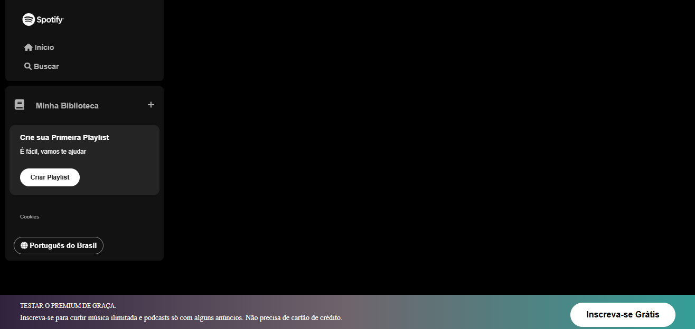
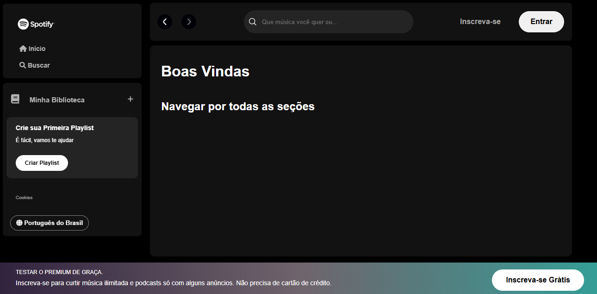

# Imersão Alura - Spotify 🎵

## Dia 1
Uma aula mais voltada para revisar alguns conseitos e tags sobre "HTML" e "CSS."

Também foi explicado de uma forma simples as diferenças do: 
- HTML(esqueleto) 
Estrutura do site.
- CSS(corpo)
Estilo do site. 
- JAVASCRIPT(cerebro)
Dinamicidade do site.

Começamos o projeto pela sidebar navigation para dar início ao projeto por partes.

## IMG Progresso

## Dia 2
Na aula de hoje focamos em desenvolver toda a parte do menu lateral, começando pela `section class="library"`.

Depois continuamos desenvolvendo as `section class="playlist"`, `section class="cookies"` e `section class="languages`.

Por fim como desafio foi proposto de criamos o footer.

Aprendendo mais sobre CSS como:
- posicionamento
- Layouts 
- Flexbox.

## IMG Progresso

## Dia 3
Nesta aula, nós fomos mais fundo sobre CSS, mexendo com as variáveis; entendendo conceitos de responsividade e, também, criando o menu superior.

Aprendi messa aula sobre:
- Refatoramos o Código
- Conseitos de Responsividade
- Estruturas de Pastas

## IMG Progresso
