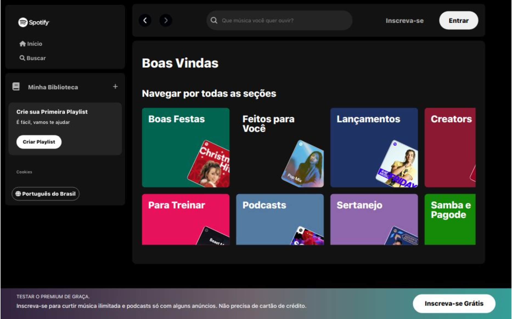
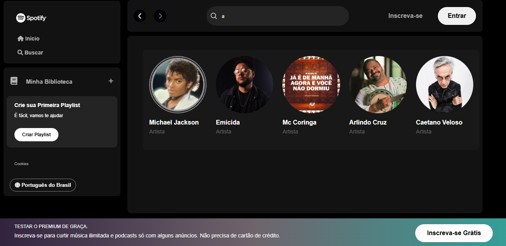

# Imersão Alura - Spotify 🎵

## Dia 1
Uma aula mais voltada para revisar alguns conseitos e tags sobre "HTML" e "CSS."

Também foi explicado de uma forma simples as diferenças do: 
- HTML(esqueleto) 
Estrutura do site.
- CSS(corpo)
Estilo do site. 
- JAVASCRIPT(cerebro)
Dinamicidade do site.

Começamos o projeto pela sidebar navigation para dar início ao projeto por partes.

## IMG Progresso

## Dia 2
Na aula de hoje focamos em desenvolver toda a parte do menu lateral, começando pela `section class="library"`.

Depois continuamos desenvolvendo as `section class="playlist"`, `section class="cookies"` e `section class="languages`.

Por fim como desafio foi proposto de criamos o footer.

Aprendendo mais sobre CSS como:
- posicionamento
- Layouts 
- Flexbox.

## IMG Progresso

## Dia 3
Nesta aula, nós fomos mais fundo sobre CSS, mexendo com as variáveis; entendendo conceitos de responsividade e, também, criando o menu superior.

Aprendi messa aula sobre:
- Refatoramos o Código
- Conseitos de Responsividade
- Estruturas de Pastas

## IMG Progresso

## Dia 4
Um Dia cheio de conteudo e muito código sobre css grid, media queries, api, manipulação do dom com javascript.

Nessa aula aplicamos funcionalidade ao nosso campo input para pesquisar as músicas quando fosse digitar.

Aprendi nessa aula sobre:
- CSS Grid Layout
- Responsividade usando Media Queries
- Instalação do Node.js
- Pacote npm para usar Json-Server
- Conceito de Dom
- Método Promises do JavaScript 

## IMG Progresso

###

